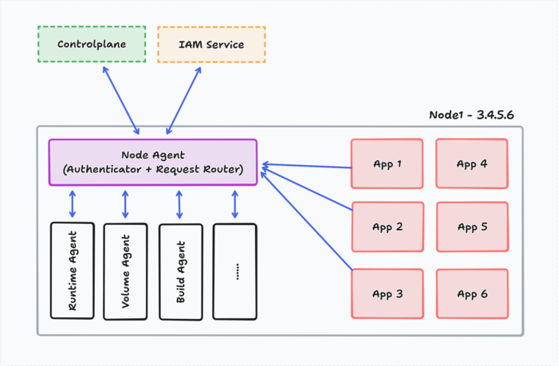
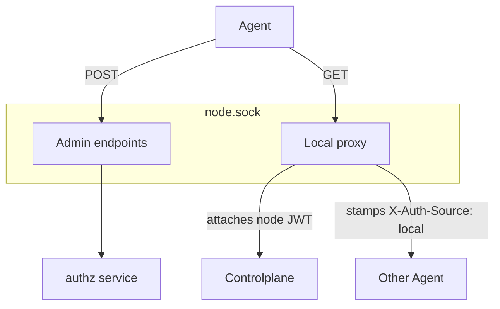
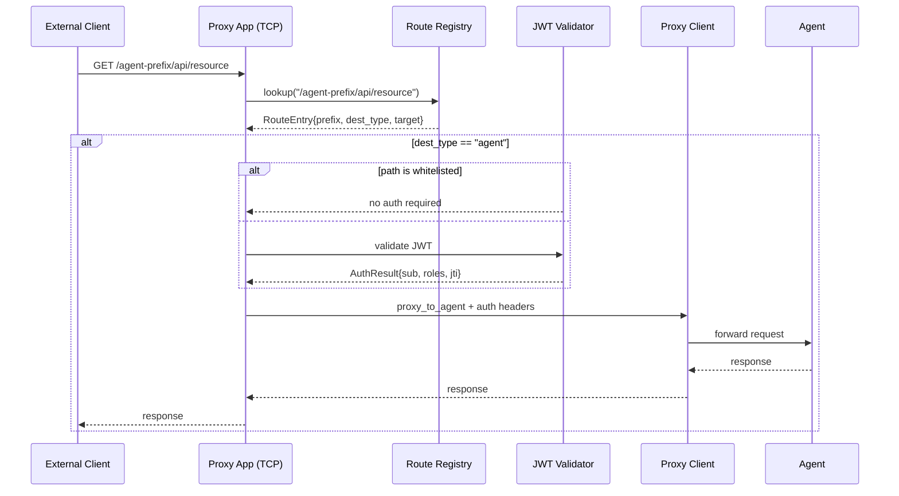
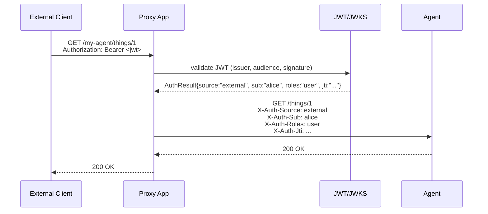
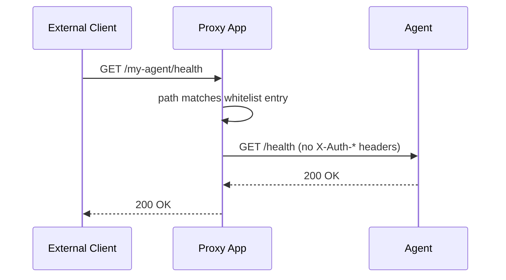
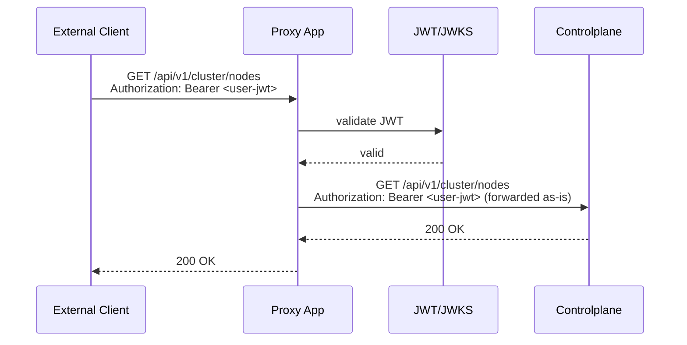
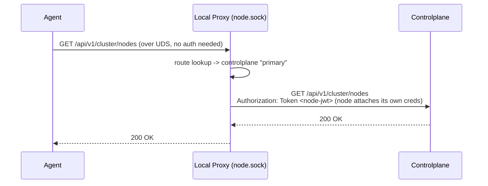
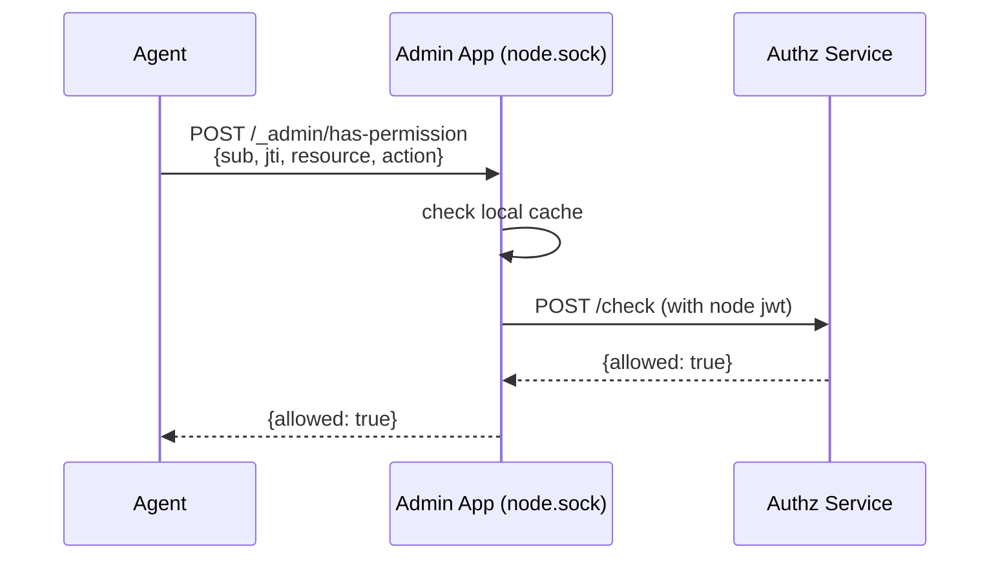
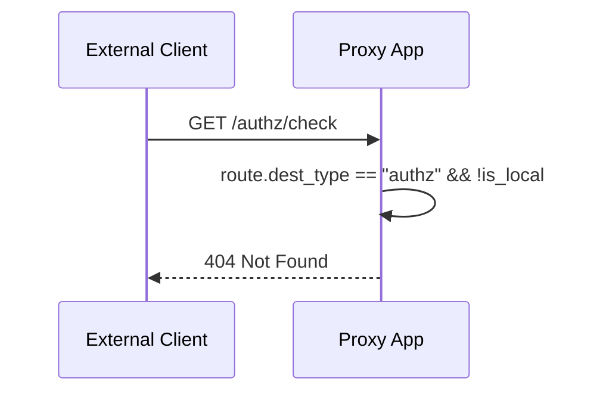
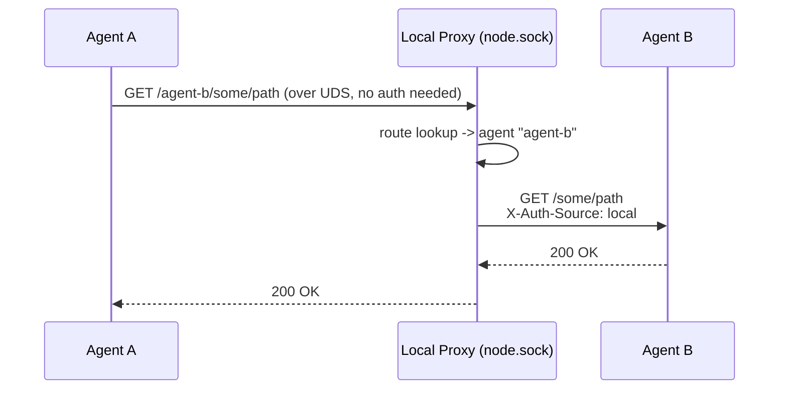

# Overview

Node Agent is a reverse proxy and service discovery layer that routes incoming HTTP requests to registered agents, controlplanes, or an authorization service. It sits at the edge of a node and manages the trust boundary between external clients and internal services.

## Architecture

## Two Servers

Node Agent runs two independent FastAPI applications:

| Server | Transport | Purpose |
|---|---|---|
| **Proxy App** | TCP (`host:port`) | Receives external HTTP traffic, validates JWTs, routes to agents/controlplanes |
| **Admin + Local Proxy** | Unix Domain Socket (`node.sock`) | Internal-only: admin endpoints (`/_admin/*`) **and** full proxy routing for agents. Agents use this to reach controlplanes, authz, or other agents without managing their own credentials- Node Agent attaches the correct JWT downstream. |

## Request Flow

## Route Types

Every request is matched against the **Route Registry** which contains three destination types:

| `dest_type` | Description | Who can access |
|---|---|---|
| **agent** | Routes registered by agents via socket discovery | External (with JWT) or local (no auth) |
| **controlplane** | Routes configured in `config.json` under `controlplanes` | External (with JWT, forwarded) or local (node credentials) |
| **authz** | Routes configured in `config.json` under `authz` | **Local only**- returns 404 to external callers |

Routes are matched using **longest-prefix matching**. When an agent registers a prefix like `/my-agent`, a request to `/my-agent/things/123` is forwarded to that agent with the path stripped to `/things/123`.

## Authentication Scenarios

### Scenario 1: External Client -> Agent (non-whitelisted route)

The agent receives `X-Auth-*` headers and must perform its own authorization check (see [Writing an Agent](4-write-agent.md)).

### Scenario 2: External Client -> Agent (whitelisted route)

Whitelisted paths bypass JWT validation entirely. No auth headers are forwarded. Use this for health checks and public endpoints.

### Scenario 3: External Client -> Controlplane

The user's original JWT is forwarded to the controlplane so it can identify the caller.

### Scenario 4: Local Agent -> Controlplane (via node.sock)

Agents route controlplane requests through `node.sock` without any credentials. The local proxy on `node.sock` looks up the route, and Node Agent attaches its own JWT (`controlplanes[].jwt_token`) downstream. The agent never needs to store or manage controlplane credentials.

### Scenario 5: Local Agent -> Authz (via node.sock)

Authz is **only** accessible via the local admin socket. External requests to authz prefixes receive a 404.

### Scenario 6: External Client -> Authz

Authz routes are hidden from external callers entirely.

### Scenario 7: Agent-to-Agent (local UDS call)

When one agent calls another through `node.sock`, the local proxy routes the request and adds `X-Auth-Source: local`. The target agent should trust this and skip authorization.

## Auth Header Reference

When the proxy forwards to an agent, it adds these headers:

| Header | Value | When |
|---|---|---|
| `X-Auth-Source` | `external` | External client with valid JWT |
| `X-Auth-Source` | `local` | Call via `node.sock` (local proxy adds this for agent-to-agent, agent-to-controlplane, or admin calls) |
| `X-Auth-Sub` | JWT `sub` claim | External only |
| `X-Auth-Roles` | Comma-separated `roles` | External only |
| `X-Auth-Jti` | JWT `jti` claim (token ID) | External only |

**If `X-Auth-Source` is missing, the request bypassed Node Agent and should be denied.**

## Agent Discovery

Agents are discovered automatically from the socket directory:

- **`.sock` files**- Unix domain socket path (production). Agent name = filename stem.
- **`.http` files**- Contains `host:port` on first line (dev-only). Requires `allow_http_agents: true` in config.
- If both `.sock` and `.http` exist for the same agent, `.sock` wins.

On discovery, Node Agent calls `GET /_meta/routes` on the agent to learn its prefixes and whitelisted paths.

## Configuration Hot Reload

Node Agent watches `config.json` for changes. On modification:
- JWKS URL/TTL updates with key cache invalidation
- Controlplane and authz routes are rebuilt
- Agent routes are preserved
- Listen host/port changes are **ignored** (require restart)
