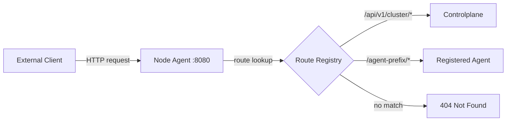
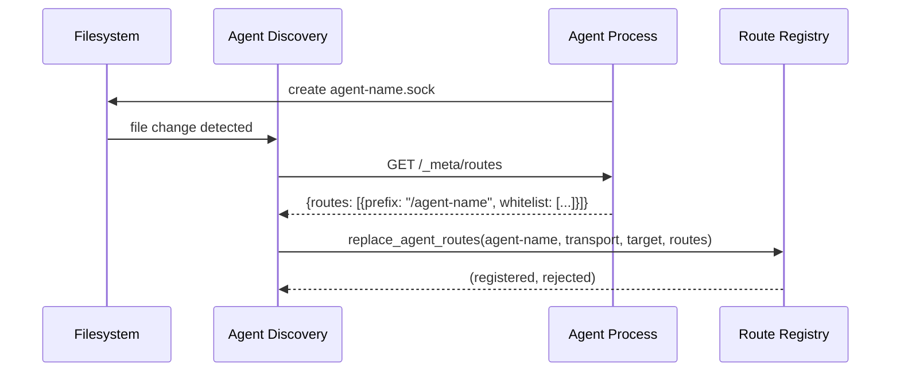

# Proxying

Node Agent acts as a reverse proxy on a TCP port (default `:8080`). External clients send HTTP requests to this port, and Node Agent routes them to the appropriate upstream service.

## How External Clients Request



1. Client sends an HTTP request to `http://<node-host>:8080/<path>`
2. Node Agent looks up the path in the Route Registry using longest-prefix matching
3. The request is forwarded to the matched upstream (agent, controlplane, or authz)
4. The response is streamed back to the client

## Routes Must Be Registered First

**A request will only be proxied if the path matches a registered route.** If no route matches, Node Agent returns `404 Not Found`.

Routes come from three sources:

| Source | How it works |
|---|---|
| **Controlplanes** | Defined statically in `config.json` under `controlplanes[].prefixes` |
| **Authz** | Defined statically in `config.json` under `authz.prefixes` |
| **Agents** | Discovered dynamically from the socket directory. Node Agent calls `GET /_meta/routes` on each agent to learn its prefixes |

### Agent Route Registration Flow



Until an agent's `.sock` (or `.http`) file exists in the socket directory **and** Node Agent has successfully fetched its routes, requests to that agent's prefix will return 404.

## Request Routing

### To an Agent

```
GET http://node:8080/my-agent/things/42
```

1. Route lookup finds prefix `/my-agent` -> agent `my-agent`
2. If `/my-agent/things/42` is **not** whitelisted, JWT validation is required
3. On success, request is forwarded to the agent with `X-Auth-*` headers
4. Path is stripped: agent receives `GET /things/42`

### To a Controlplane

```
GET http://node:8080/api/v1/cluster/nodes
```

1. Route lookup finds prefix `/api/v1/cluster` → controlplane `primary`
2. JWT validation is required
3. The **original user JWT** is forwarded to the controlplane (not replaced)
4. Path is passed through as-is

### To Authz

External requests to authz prefixes are **always rejected with 404**. Authz is only accessible via the local admin socket.

## Authentication for External Requests

For non-whitelisted agent routes and all controlplane routes, external clients must provide a valid JWT:

```
Authorization: Bearer <jwt>
```

The JWT is validated against:
- **JWKS**: fetched from `jwks.url` in config, cached for `jwks.cache_ttl_seconds`
- **Issuer**: must match `jwt.issuer`
- **Audience**: must match `jwt.audience`
- **Algorithm**: EdDSA (Ed25519)
- **Required claims**: `exp`, `iat`, `sub`, `jti`

### Whitelisted Paths

Agents can declare whitelisted paths that bypass JWT validation:

```json
{
  "routes": [
    {
      "prefix": "/dummy",
      "whitelist": [
        {"path": "/dummy/health", "match": "exact"},
        {"path": "/dummy/public/", "match": "prefix"}
      ]
    }
  ]
}
```

Match modes:

| Mode | Behavior |
|---|---|
| `exact` | Path must exactly match |
| `exact_or_prefix` | Exact match or any path starting with the prefix |
| `prefix` | Any path starting with the prefix (but not the prefix itself) |

Whitelisted requests are forwarded **without** `X-Auth-*` headers.

## Proxy Behavior

### Request Transformation

- **Hop-by-hop headers** are stripped: `connection`, `keep-alive`, `proxy-authenticate`, `proxy-authorization`, `te`, `trailers`, `transfer-encoding`, `upgrade`, `host`, `content-length`
- **Sensitive inbound headers** are stripped before forwarding: `authorization`, `x-auth-token`, `x-auth-source`, `x-auth-sub`, `x-auth-roles`, `x-auth-jti`
- **Query strings** are preserved
- **Request body** is limited to 128 MB (returns 413 if exceeded)

### Response Handling

- Responses are **streamed** back to the client
- Hop-by-hop response headers are stripped
- All HTTP methods are supported: GET, POST, PUT, PATCH, DELETE, HEAD, OPTIONS

### Error Responses

| Status | Meaning |
|---|---|
| 401 | Missing or invalid JWT |
| 404 | No route matched the path |
| 413 | Request body exceeds 128 MB |
| 502 | Upstream connection failed |
| 503 | Upstream service not configured or unavailable |
| 504 | Upstream read timeout |

## Health Check

```
GET http://node:8080/_meta/health
```

Returns `{"status": "ok"}`. This endpoint does not require authentication.
