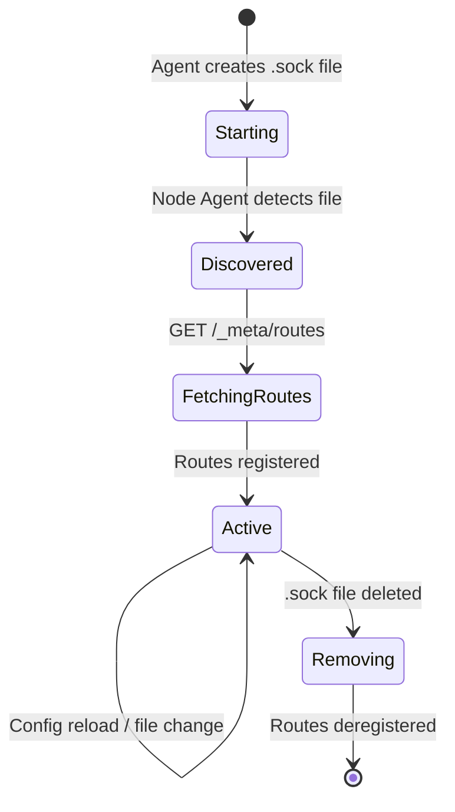

# Writing an Agent

An agent is any HTTP service that registers with Node Agent by placing a socket file in the shared socket directory. Agents receive proxied requests from external clients and other agents.

## Required API

### `GET /_meta/routes`

Node Agent calls this endpoint on every discovered agent to learn what URL prefixes it owns and which paths are public.

**Response format:**

```json
{
  "routes": [
    {
      "prefix": "/my-agent",
      "whitelist": [
        {"path": "/my-agent/health"},
        {"path": "/my-agent/public/", "match": "prefix"}
      ]
    }
  ]
}
```

| Field | Type | Required | Description |
|---|---|---|---|
| `prefix` | string | **Yes** | URL prefix this agent owns. Cannot be `/`, `/*`, or overlap with controlplane/authz prefixes |
| `whitelist` | array | No | Paths that bypass JWT validation |
| `whitelist[].path` | string | **Yes** | The whitelisted path |
| `whitelist[].match` | string | No | Match mode: `exact` (default), `exact_or_prefix`, `prefix` |

**Important:** The prefix you declare here is stripped from incoming requests. If you register `/my-agent` and a client calls `/my-agent/api/list`, your handler receives `/api/list`.

## Transport Options

### Unix Domain Socket (Production)

Use the client library to resolve the correct socket path:

```python
import uvicorn
from pathlib import Path
from press_node_agent_client import get_my_agent_socket_path

sock_path = get_my_agent_socket_path("my-agent")
Path(sock_path).parent.mkdir(parents=True, exist_ok=True)
Path(sock_path).unlink(missing_ok=True)

uvicorn.run(app, uds=sock_path)
```

### HTTP (Development Only)

Requires `allow_http_agents: true` in node-agent config. Create a `.http` file containing `host:port`:

```python
import uvicorn
from pathlib import Path
from press_node_agent_client import get_my_agent_socket_path

SOCKET_DIR = Path(get_my_agent_socket_path("my-agent")).parent
host = "127.0.0.1"
port = 8090
marker = SOCKET_DIR / "my-agent.http"
marker.write_text(f"{host}:{port}\n")

try:
    uvicorn.run(app, host=host, port=port)
finally:
    marker.unlink(missing_ok=True)
```

If both `.sock` and `.http` exist for the same agent, `.sock` takes priority.

## Authorization in Your Agent

Every non-whitelisted request arrives with auth headers added by Node Agent. Your agent **must** check these headers to determine who is calling and whether they are allowed.

### Auth Headers

```python
def get_auth_context(request: Request) -> dict:
    return {
        "source": request.headers.get("x-auth-source"),
        "sub": request.headers.get("x-auth-sub", ""),
        "roles": request.headers.get("x-auth-roles", ""),
        "jti": request.headers.get("x-auth-jti", ""),
    }
```

| Header | Value | Meaning |
|---|---|---|
| `X-Auth-Source` | `external` | Request came from an external client through the TCP proxy |
| `X-Auth-Source` | `local` | Request came via `node.sock` (local proxy adds this for agent-to-agent, agent-to-controlplane, or admin calls) |
| `X-Auth-Sub` | JWT `sub` | User identity (external only) |
| `X-Auth-Roles` | comma-separated | User roles from JWT (external only) |
| `X-Auth-Jti` | JWT `jti` | Token ID for authz caching (external only) |

**If `X-Auth-Source` is missing, the request bypassed Node Agent - deny it.**

### Three Caller Types

```mermaid
graph TD
    Request[Incoming Request] --> Check{X-Auth-Source present?}
    Check -->|No| Deny[401 Unauthorized]
    Check -->|Yes| Source{X-Auth-Source value}
    Source -->|local| Trust[Trust - skip authz]
    Source -->|external| Roles{Check X-Auth-Roles}
    Roles -->|admin / telemetry| Trust2[Agent-decided shortcut - skip authz]
    Roles -->|user / other| Authz[Call has_permission()]
```

#### 1. Local Agent Call (`X-Auth-Source: local`)

Another agent on the same node called you through `node.sock`. Trust it - skip authorization.

```python
src = request.headers.get("x-auth-source")
if src == "local":
    # Trusted inter-agent call, no authz needed
    return handle_request()
```

#### 2. Admin External Call (role-based shortcut)

An external user with a privileged role (e.g. `admin`, `telemetry`) - your agent decides which roles get shortcuts.

```python
roles = request.headers.get("x-auth-roles", "").split(",")
if "admin" in roles or "telemetry" in roles:
    # Privileged user, skip per-resource authz
    return handle_request()
```

#### 3. Normal External Call (requires authz check)

A regular user calling your agent. Use the client library to check permissions:

```python
from press_node_agent_client import has_permission

async def check_permission(sub: str, jti: str, resource_type: str, resource_id: str, action: str) -> bool:
    return await has_permission(
        sub=sub,
        jti=jti,
        resource_type=resource_type,
        resource_id=resource_id,
        action=action,
    )
```

### Complete Auth Check Example

```python
from fastapi import FastAPI, HTTPException, Request
from press_node_agent_client import has_permission

app = FastAPI()

def _check_auth(request: Request) -> tuple[str, str, str, str]:
    """Extract and validate auth context. Raises 401 if missing."""
    src = request.headers.get("x-auth-source")
    if not src:
        raise HTTPException(status_code=401, detail="missing X-Auth-Source")
    sub = request.headers.get("x-auth-sub", "")
    roles = request.headers.get("x-auth-roles", "")
    jti = request.headers.get("x-auth-jti", "")
    return src, sub, roles, jti

async def _authorize(request: Request, resource_type: str, resource_id: str, action: str) -> bool:
    """Coarse permission check. Returns True if allowed."""
    src, sub, roles, jti = _check_auth(request)

    # Local calls are trusted
    if src == "local":
        return True

    # Role-based shortcuts (agent decides which roles)
    role_list = [r.strip() for r in roles.split(",") if r.strip()]
    if "admin" in role_list or "telemetry" in role_list:
        return True

    # Normal external user - check with authz service
    return await has_permission(
        sub=sub,
        jti=jti,
        resource_type=resource_type,
        resource_id=resource_id,
        action=action,
    )

@app.get("/things/{thing_id}")
async def get_thing(thing_id: str, request: Request):
    allowed = await _authorize(request, "Thing", thing_id, "Read")
    if not allowed:
        raise HTTPException(status_code=403, detail="forbidden")
    return {"id": thing_id}
```

## Using the Client Library

Install the client in your agent project:

```bash
pip install press-node-agent-client
```

The library resolves socket paths from environment variables and provides typed helpers for all node-agent communication.

### Checking Permissions

```python
from press_node_agent_client import has_permission

allowed = await has_permission(
    sub="alice",
    jti="abc-123",
    resource_type="Thing",
    resource_id="42",
    action="Read",
)
# allowed: True or False
```

### Reaching Controlplanes (No Credentials Needed)

Agents can reach controlplanes without storing or sending any JWT. The local proxy on `node.sock` matches the route and attaches the node's own JWT downstream.

```python
from press_node_agent_client import send_request

# GET request to controlplane
resp = await send_request("GET", "/api/v1/cluster/nodes")
print(resp.json())

# POST request with body
resp = await send_request(
    "POST",
    "/api/v1/events",
    json={"type": "deploy", "service": "web"},
)
```

### Calling Another Agent

Route through `node.sock` with the target's prefix. The target agent receives `X-Auth-Source: local`.

```python
from press_node_agent_client import send_request

resp = await send_request("GET", "/other-agent/some/path")
```

### Refreshing Routes

```python
from press_node_agent_client import refresh_agent_routes

# Refresh a specific agent
await refresh_agent_routes(agent="my-agent")

# Refresh all agents
await refresh_agent_routes()
```

### Environment Variables

| Variable | Default | Purpose |
|---|---|---|
| `NODE_AGENT_SOCKET` | `<AGENT_SOCKET_DIR>/node.sock` | Override the node-agent socket path |
| `AGENT_SOCKET_DIR` | `/run/press-node-agent` | Base directory for agent socket files |

## Route Registration Rules

When Node Agent fetches your routes, it validates and may reject prefixes:

| Rejection Reason | Example |
|---|---|
| Empty or root prefix | `""`, `"/"`, `"/*"` |
| Overlaps controlplane prefix | Your `/api/v1` conflicts with controlplane's `/api/v1/cluster` |
| Overlaps authz prefix | Your `/authz` conflicts with authz's `/authz` |
| Already owned by another agent | `/other-agent` is already registered |

Node Agent returns `(registered, rejected)` lists. Check your logs for rejections.

## Lifecycle



- **Startup**: Create your `.sock` file in the socket directory. Node Agent detects it via filesystem watch.
- **Discovery**: Node Agent calls `GET /_meta/routes` to learn your prefixes.
- **Active**: Your routes are registered. External requests are proxied to you.
- **Reconciliation**: Node Agent re-checks every 5 minutes and on any filesystem change.
- **Shutdown**: Delete your `.sock` file. Node Agent deregisters your routes.
